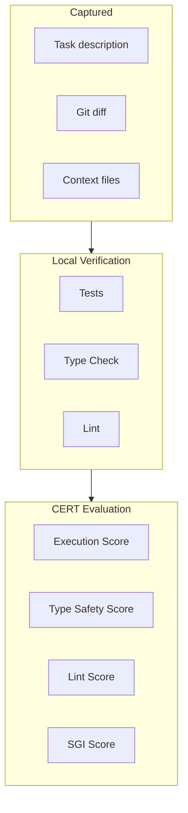
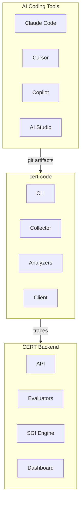

<div align="center">


# cert-code

**Quality metrics for AI-generated code.**

[](https://github.com/Javihaus/cert-code/actions/workflows/ci.yml)
[](https://badge.fury.io/py/cert-code)
[](https://www.python.org/downloads/)
[](https://opensource.org/licenses/Apache-2.0)

[Installation](#installation) · [Quick Start](#quick-start) · [Examples](#examples) · [Configuration](#configuration) · [SGI Paper](https://arxiv.org/abs/2512.13771)

</div>

---

## The Gap We Fill

You use AI coding assistants. They generate code. But you cannot answer:

- Did the generated code actually work?
- Did it follow our codebase patterns?
- Which AI tool produces better results for our stack?
- How is AI code quality trending over time?

**No existing tool solves this.**

| Tool | What it does | Limitation |
|------|--------------|------------|
| SonarQube, CodeClimate | Static code analysis | No knowledge of AI intent — sees code, not "what was asked" |
| Langfuse, Braintrust | LLM observability | Requires SDK instrumentation — cannot see Claude Code, Cursor, Copilot |
| Manual review | Human inspection | Does not scale, no metrics, no trends |

---

## What Makes cert-code Unique

| Capability | cert-code |
|------------|-----------|
| Captures AI-generated code from ANY tool | Yes — operates on git artifacts, not API interception |
| Links task description to generated code | Yes — "what you asked" mapped to "what you got" |
| Measures alignment with your codebase patterns | Yes — via [Semantic Grounding Index](https://arxiv.org/abs/2512.13771) |
| Compares AI tools objectively | Yes — track Cursor vs Copilot vs Claude Code over time |
| Provides audit trail for AI-generated code | Yes — every trace stored with full context |

---

## How It Works

```mermaid
flowchart LR
    subgraph AI["AI Coding Assistant"]
        A1[Claude Code]
        A2[Cursor]
        A3[Copilot]
        A4[AI Studio]
    end
    
    subgraph Capture["cert-code"]
        B1[Git Diff]
        B2[Task Description]
        B3[Verification]
    end
    
    subgraph Evaluate["CERT Backend"]
        C1[Tests]
        C2[Types]
        C3[Lint]
        C4[SGI]
    end
    
    subgraph Output["Results"]
        D1[Dashboard]
        D2[Metrics API]
    end
    
    AI --> |generates code| Capture
    Capture --> |submits trace| Evaluate
    Evaluate --> Output
```



| Step | What happens |
|------|--------------|
| 1 | You use an AI assistant to generate code |
| 2 | You commit the generated code |
| 3 | cert-code extracts the git diff and runs verification (tests, lint, types) |
| 4 | CERT backend evaluates quality including SGI (context alignment) |
| 5 | Results appear in dashboard with metrics and trends |

---

## Installation

```bash
pip install cert-code
```

---

## Quick Start

```bash
# Initialize in your project
cd your-project
cert-code init

# Set your API key
export CERT_CODE_API_KEY=your-key-from-cert-dashboard

# After AI generates code and you commit it
cert-code submit --task "Add pagination to user API"
```

---

## Output

After submission, cert-code returns evaluation results:

| Metric | Value | Description |
|--------|-------|-------------|
| Trace ID | `trace_8f3a2b1c` | Unique identifier for this evaluation |
| Overall Score | 87% | Weighted combination of all metrics |
| Status | PASS | PASS / REVIEW / FAIL |
| Tests | 100% | Test pass rate |
| Type Safety | 100% | Type check pass rate |
| Lint | 92% | Lint cleanliness score |
| Context Alignment (SGI) | 78% | Alignment with provided context |

Detailed results and historical trends are available in the CERT dashboard.

---

## Examples

### Claude Code

```bash
# Claude Code generates pagination code, you commit it
git commit -m "Add pagination to user list endpoint"

# Evaluate
cert-code submit \
  --task "Add pagination to user list endpoint with offset/limit params" \
  --tool "claude-code" \
  --run-tests
```

### Cursor

```bash
# Cursor refactors your database module, you commit it
git commit -m "Refactor database connection pooling"

# Evaluate with context files for SGI calculation
cert-code submit \
  --task "Refactor database module to use connection pooling" \
  --tool "cursor" \
  --context src/db/base.py \
  --context docs/database-patterns.md \
  --run-tests \
  --run-typecheck
```

### GitHub Copilot

```bash
# Copilot generates endpoint code via autocomplete, you commit it
git commit -m "Add orders endpoint with CRUD operations"

# Evaluate
cert-code submit \
  --task "Implement orders REST endpoint with create, read, update, delete" \
  --tool "copilot" \
  --context api/endpoints/users.py \
  --run-tests \
  --run-lint
```

### Google AI Studio / Gemini

```bash
# You paste generated code from AI Studio into your project, then commit
git commit -m "Add date parsing utilities"

# Evaluate
cert-code submit \
  --task "Generate date parsing utilities: parse_iso, format_relative, get_timezone" \
  --tool "google-ai-studio" \
  --run-tests \
  --run-typecheck
```

### ChatGPT (Copy-Paste Workflow)

```bash
# You paste code from ChatGPT into your editor, then commit
git commit -m "Add retry logic to HTTP client"

# Evaluate
cert-code submit \
  --task "Add exponential backoff retry logic to HTTP client with max 3 retries" \
  --tool "chatgpt" \
  --run-tests
```

### Automated via Git Hook

```bash
# Install hook once
cert-code hook --type post-commit

# Now every commit is automatically evaluated
# Commit message is used as task description
git commit -m "Add caching layer to reduce database queries"

# Skip evaluation for specific commits
CERT_CODE_SKIP=1 git commit -m "Fix typo"
```

---

## What Gets Evaluated



| Metric | What it measures | Source |
|--------|------------------|--------|
| Execution | Do tests pass? | Your test suite (pytest, jest, go test, etc.) |
| Type Safety | Are there type errors? | mypy, tsc, go vet, etc. |
| Lint | Does code follow standards? | ruff, eslint, clippy, etc. |
| Context Alignment | Did AI follow your patterns? | [Semantic Grounding Index](https://arxiv.org/abs/2512.13771) |

---

## Semantic Grounding Index (SGI)

When you provide context files, CERT calculates **SGI** — a metric from [published research](https://arxiv.org/abs/2512.13771) that measures whether generated content aligns with provided references.

**For code, SGI answers:** Did the AI follow your codebase patterns, or generate generic code from training data?

| SGI Score | Interpretation |
|-----------|----------------|
| < 0.95 | Strong alignment — code follows your patterns |
| 0.95 - 1.2 | Partial alignment — review recommended |
| > 1.2 | Weak alignment — AI may have ignored your context |

**Usage:**

```bash
# Provide your existing code as context
cert-code submit \
  --task "Add orders endpoint" \
  --context src/api/base.py \
  --context src/api/users.py
```

If SGI is high, the generated code may not match your codebase conventions even if tests pass.

---

## Configuration

### `.cert-code.toml`

```toml
[api]
url = "https://cert-framework.dev/api/v1"
# key = "..."  # Recommended: use CERT_CODE_API_KEY env var instead

[project]
id = "proj_abc123"       # From CERT dashboard
name = "backend-api"

[behavior]
auto_detect_language = true
auto_run_tests = false
auto_run_lint = false
auto_run_typecheck = false

[test]
command = "pytest"
timeout = 300

[lint]
command = "ruff check ."

[typecheck]
command = "mypy ."

[context]
files = ["README.md", "docs/architecture.md"]
max_size = 100000
```

### Environment Variables

| Variable | Description |
|----------|-------------|
| `CERT_CODE_API_KEY` | Your CERT API key (required) |
| `CERT_CODE_PROJECT_ID` | Default project ID |
| `CERT_CODE_TASK` | Task description for git hooks |
| `CERT_CODE_SKIP` | Set to "1" to skip hook |

---

## CLI Reference

| Command | Description |
|---------|-------------|
| `cert-code submit` | Submit evaluation |
| `cert-code init` | Initialize configuration |
| `cert-code hook` | Install/remove git hooks |
| `cert-code status` | Check configuration and connectivity |

### submit options

| Option | Description |
|--------|-------------|
| `--task, -t` | Task description (required) |
| `--tool` | AI tool name (claude-code, cursor, copilot, etc.) |
| `--ref` | Git reference (default: HEAD) |
| `--base-ref` | Base reference for comparison |
| `--run-tests` | Run tests before submitting |
| `--run-lint` | Run linter |
| `--run-typecheck` | Run type checker |
| `--context, -c` | Context files (repeatable) |
| `--dry-run` | Preview without submitting |

---

## Python API

```python
from cert_code import CodeCollector, CertCodeConfig, CollectorOptions

config = CertCodeConfig.load()

with CodeCollector(config) as collector:
    result = collector.from_commit(
        task="Add pagination to user API",
        ref="HEAD",
        options=CollectorOptions(
            run_tests=True,
            context_files=["src/api/base.py"],
        ),
        tool="claude-code",
    )
    
    if result.success:
        print(f"Trace ID: {result.trace_id}")
        print(f"Score: {result.evaluation['score']}")
```

---

## Architecture



cert-code operates on artifacts (git diffs), not API interception. This means it works with any AI coding tool, including those that do not expose their API calls.

---

## Supported Languages

| Language | Tests | Lint | Types |
|----------|-------|------|-------|
| Python | pytest | ruff | mypy |
| JavaScript | jest | eslint | — |
| TypeScript | jest | eslint | tsc |
| Go | go test | golangci-lint | go vet |
| Rust | cargo test | clippy | cargo check |
| Java | JUnit | checkstyle | — |
| Ruby | rspec | rubocop | sorbet |

---

## Contributing

```bash
git clone https://github.com/Javihaus/cert-code.git
cd cert-code
pip install -e ".[dev]"
pytest
```

---

## License

Apache 2.0 — See [LICENSE](LICENSE)

---
